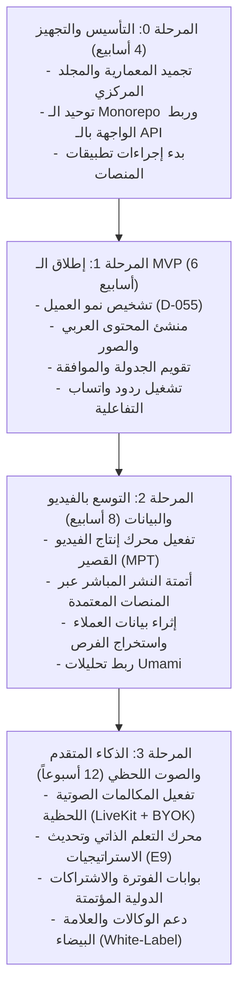

# 🗺️ خارطة طريق الميزات عبر المراحل (Feature Roadmap)
**تاريخ التحديث:** 28 أكتوبر 2026

---

## 📈 مراحل التطوير والتوسع

```mermaid
flowchart TD
    P0["المرحلة 0: التأسيس والتجهيز (4 أسابيع)<br/>- تجميد المعمارية والمجلد المركزي<br/>- توحيد الـ Monorepo وربط الواجهة بالـ API<br/>- بدء إجراءات تطبيقات المنصات"]
    P1["المرحلة 1: إطلاق الـ MVP (6 أسابيع)<br/>- تشخيص نمو العميل (D-055)<br/>- منشئ المحتوى العربي والصور<br/>- تقويم الجدولة والموافقة<br/>- تشغيل ردود واتساب التفاعلية"]
    P2["المرحلة 2: التوسع بالفيديو والبيانات (8 أسابيع)<br/>- تفعيل محرك إنتاج الفيديو القصير (MPT)<br/>- أتمتة النشر المباشر عبر المنصات المعتمدة<br/>- إثراء بيانات العملاء واستخراج الفرص<br/>- ربط تحليلات Umami"]
    P3["المرحلة 3: الذكاء المتقدم والصوت اللحظي (12 أسبوعاً)<br/>- تفعيل المكالمات الصوتية اللحظية (LiveKit + BYOK)<br/>- محرك التعلم الذاتي وتحديث الاستراتيجيات (E9)<br/>- بوابات الفوترة والاشتراكات الدولية المؤتمتة<br/>- دعم الوكالات والعلامة البيضاء (White-Label)"]

    P0 --> P1 --> P2 --> P3
```
